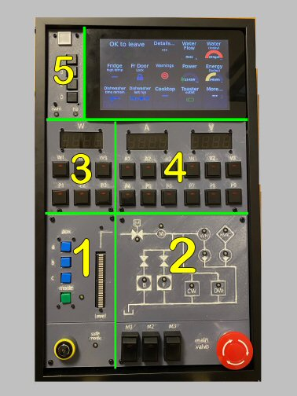

# Home Assistant Control Panel

A wall mounted control panel for Home Assistant, as seen in this video: https://youtu.be/Oz87wOJSQm8. 

This repository contains the STL files to print the panel pieces, a detailed parts list, and helpful information for anyone looking to build a similar panel... More to follow! (I think my actual code would generate more questions than answers, which I would not have time to address, so for now, the code is not here.)

## STL Files

The STL files for the five panels are in the STL folder. The sixth panel is the Pi 7" touch screen assembly. I used Inland PLA+ gray filament. See the panel layout image below:

The frame is called a "[Floater Frame](https://framing4yourself.com/product/matte-black-floater-frame-20101-m/)" and for this project is 9.25 inches x 15.75 inches.

The panels are held in place with a combination of M2.5 and M3 nylon stand offs such as [these](https://www.amazon.com/dp/B073GLW6NL). The M3 stand offs are drectly attached to the holes in the panels, while the M2.5 are used behind the LED seven segment displays to extend them to the back of the frame.

If you want the frame to mount flush to the wall, don't forget to drill extra space for any screw heads on the back of the frame!

## Parts List

For everything except the display:

| Quantity | Part Description | Vendor/link | Notes |
| -------- | ---------------- | ----------- | ----- |
| 1        | M3 Nylon Stand Off Set | [Amazon](https://www.amazon.com/dp/B073GLW6NL) | |
| 1        | 3.3V Buck Regulator | [SparkFun](https://www.sparkfun.com/products/18356) | | 
| 1        | Tactile Push Button Caps, Black | [Amazon](https://www.amazon.com/dp/B07PK3W4XL) | For top display |
| 1        | 2 pack 12x16 Inches Green Translucent Acrylic/Plexiglass Sheet | [Amazon](https://www.amazon.com/dp/B09KC47RLH) | Mounted in back of frame |
| 2        | 10Pcs Non Locking Push Button Switch 19x19mm with LED | [Amazon](https://www.amazon.com/dp/B07CXN14QV) | |
| 1        | Gel filter for 7 segment LEDs | [Amazon](https://www.amazon.com/dp/B0CXXQSDXH) | |
| 30       | 220 ohm 5% resistors | Various | |
| 10       | 1k ohm 5% resistors | Various | | 
| 1        | Bi-Color (Red/Green) 24-Bar Bargraph w/I2C Backpack | [Adafruit](https://www.adafruit.com/product/1721) | | 
| 3        | 3mm Plastic Bevel LED Holder - Pack of 5 | [Adafruit](https://www.adafruit.com/product/2179) | | 
| 1        | Adafruit Perma-Proto 40-Pin Raspberry Pi Half-Size PCB Kit | [Adafruit](https://www.adafruit.com/product/4353)
| 3        | Adafruit MCP23017 I2C GPIO Expander Breakout | [Adafruit](https://www.adafruit.com/product/5346) | | 
| 3        | Adafruit 0.56" 4-Digit 7-Segment Display with I2C Backpack - Red | [Adafruit](https://www.adafruit.com/product/878) | |
| 1        | Key Switch 2PCS 16MM with Key Latching SPDT (2 Position 1NO1NC Round Yellow) | [Amazon](https://www.amazon.com/gp/product/B09FXC26WL) | For safe mode switching | 
| 1        | Emergency Stop Mushroom Push Button Switch | [DFRobot](https://www.dfrobot.com/product-521.html) | For valve shutoff |
| 1        | Lystaii 320pcs M2 Nylon Hex Spacer Standoff Kit | [Amazon](https://www.amazon.com/gp/product/B0BYSHZ2TD) | For mounting 7 seg displays |
| 1        | Colorful 12mm Square Tactile Button Switch Assortment | [Adafruit](https://www.adafruit.com/product/1010) | |
| 1        | CHANZON 100 pcs 3mm Red & Green Diffused LED Diode Lights Common Cathode | [Amazon](https://www.amazon.com/gp/product/B01CFZMSNO) | |
| 3        | Radio Shack SPST Rocker Switch with LED #275-013 | Radio Shack | Bottom row - Discontinued |
| 2        | Raspberry Pi 3B+ with SD card | Various | Can probably be combined into one unit |
| 2        | Raspberry Pi POE HAT | [Raspberry Pi](https://www.raspberrypi.com/products/poe-hat/) | PoE+ HAT will not fit ribbon cable |
| 4        | GPIO Stacking Header | [Adafruit](https://www.adafruit.com/product/2223) | To allow ribbon cable and POE HAT - see notes |
| 1        | Diffused Red Indicator LED - 15mm Square | [Adafruit](https://www.adafruit.com/product/4041) | For alarm LED at top left |
| 1        | 5V Buzzer | [Adafruit](https://www.adafruit.com/product/1536) | |
| 1        | Pi Foundation Display - 7" Touchscreen | [Raspberry Pi](https://www.raspberrypi.com/products/raspberry-pi-touch-display/) | | 

Additional items:
- wire, various sizes and gauges
- dupont cables, female
- various proto boards to mount tactile switches
- headers for PCBs
- floater frame, glue, and clamp (see above section)

## Hardware Setup

- All of the LEDs and switches are connected directly to various Pi GPIO pins. (I'm using lgpio/rpi-lgpio for GPIO access)
- Everything else is connected via I2C Qwiic connectors

## Software Notes

All of the software runs in containers, which can be accomplished using regular Docker or my favorite platform for embedded devices - [balenaCloud](https://www.balena.io/). (Note that everything runs locally on the device with balena - the "cloud" part is an optional dashboard for updating, rebooting, and troubleshooting the Pi.)

Commands are sent to Home Assistant (when buttons are pressed) via the Home Assistant REST API: https://developers.home-assistant.io/docs/api/rest/
All the code is written in Python, and the [Requests](https://requests.readthedocs.io/en/latest/) library is used to call the API.

The LEDs are updated based on real time updates from Home Assistant using Python and the web socket API: https://developers.home-assistant.io/docs/api/websocket

## Touch display

The touch display is running custom dashboards made for [HADashboard](https://appdaemon.readthedocs.io/en/latest/DASHBOARD_INSTALL.html) which is part of a Home Assistant plugin called AppDaemon.

It's displayed on a Chromium browser in a container via a project called the [browser block](https://github.com/balena-io-experimental/browser).

