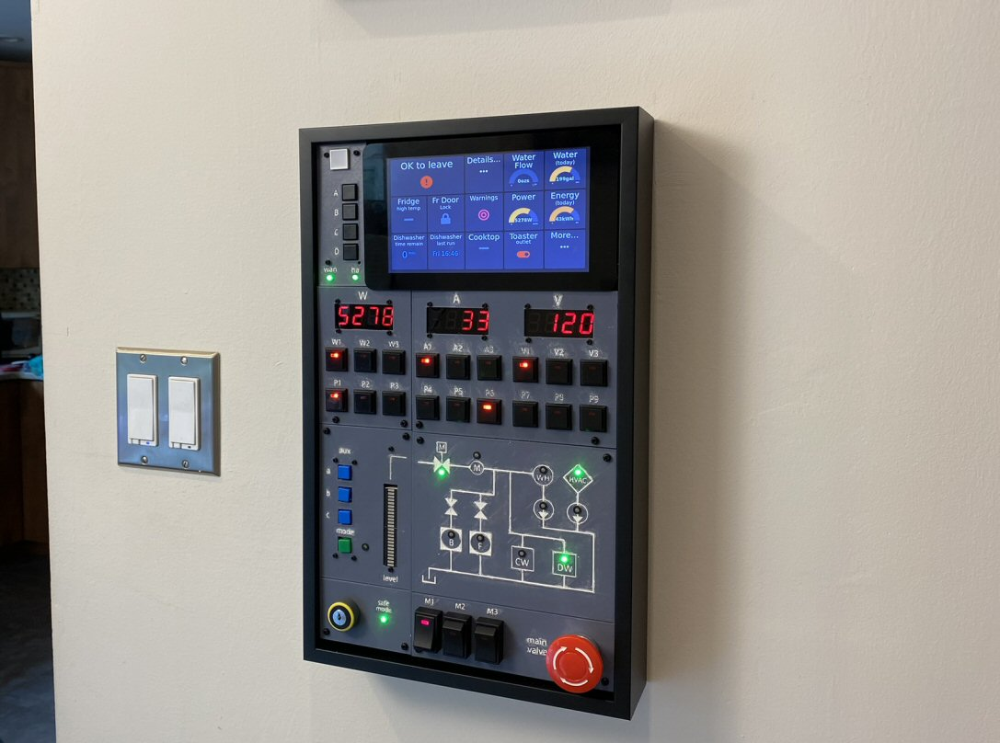

# Home Assistant Control Panel

A wall mounted control panel for Home Assistant, as seen in this video: https://youtu.be/Oz87wOJSQm8. 

This repository contains all of the files for the working unit (or will in time - I'm continually adding to this repo.) However, this is not a tutorial or kit - this is mainly a template and provided as inspiration for others wanting to make a similar panel. Feel free to use or modify these files, which are provided as-is and without support. 

## STL Files

The STL files for the five panels are in the STL folder. The sixth panel is the Pi 7" touch screen assembly. See the layout image below:

The frame is called a "[Floater Frame](https://framing4yourself.com/product/matte-black-floater-frame-20101-m/)" and for this project is 9.25 inches x 15.75 inches.

The panels are held in place with a combination of M2.5 and M3 nylon stand offs such as [these](https://www.amazon.com/dp/B073GLW6NL). The M3 stand offs are drectly attached to the holes in the panels, while the M2.5 are used behind the LED seven segment displays to extend them to the back of the frame.

If you want the frame to mount flush to the wall, don't forget to drill extra space for any screw heads on the back of the frame!

